# PLOG - Avaliação Intercalar

Grupo: JIN_LI_5

Turma: 5

Iohan Xavier Sardinha Dutra Soares (up201801011)

João Diogo Vila Franca Gonçalves (up201806162)

---
### Instalação e Execução
Abrir o SICStus Prolog e fazer consult do ficheiro "game.pl".

### O Jogo Jin_Li

Neste jogo, cada jogador possui duas carpas e dez pedras. Um par de carpas vermelho outro amarelo.

O Objetivo do jogo é fazer dez pontos, fazendo com que suas carpas tenham o máximo de contato umas com as outras.

O tabuleiro do jogo tem formato quadrado, com 7x7 casas.

Os jogadores começam com suas carpas nas extremidades do tabuleiro: Em cima as duas vermelhas uma na extrimidade esquerda e outra na direita, e da mesma forma, em baixo, as amarelas.

Os jogadores intercalam jogadas.

Em cada jogada podem se mover de duas formas:

- **Nadar**: Onde se move uma casa em qualquer direção, diagonal ou lateral, e após nadar põe uma pedra em qualquer casa vazia do tabuleiro. Se já tiver posto todas as dez pedras não se põe nenhuma.
- **Saltar**: O jogador pode saltar por cima de uma pedra adjacente, também em qualquer direção, aterrisando numa casa vazia do outro lado. As carpas só conseguem saltar uma pedra de cada vez e após fazê-lo o jogador **não** pode por uma nova pedra no tabuleiro, diferente de quando nada.

Ao final de cada jogada o jogador que se moveu ganha pontos de acordo com a quantidade de carpas adjecentes a carpa que se acabou de se mover, independente da cor do outro peixe.

O jogo acaba assim que um jogador acumular dez pontos.

---

### Lógica do Jogo:
#### Representação do Estado do Jogo   
O estado do jogo (BoardState) é representado por:

- Tabuleiro
  Constituido de uma lista de listas, com o estado de cada casa do tabuleiro, podendo ser:

  - _empty_ - Casa vazia
  - _red_ - Carpa vermelha
  - _yellow_ - Carpa amarela
  - _stone_ - Pedra


- Quantidade de Pedras de cada jogador
  Quantidade de pedras é inicialmente dez e é decrementada toda vez que um jogador coloca uma pedra no tabuleiro, através de predicados dinâmicos.
- Pontuação
  Valor da pontuação de cada jogador, inicialmente zero para os dois e será incrementado a cada rodada que o jogador pontuar. Através de predicados dinâmicos.


Demostração dos estados do jogo, inicial, meio e final, respectivamente:

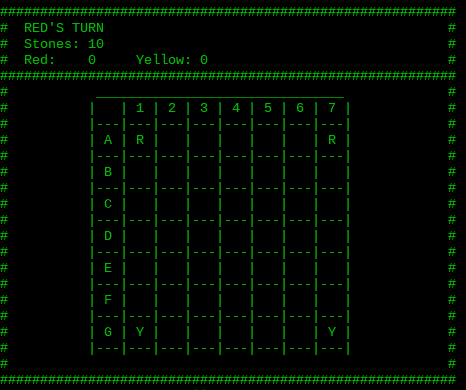
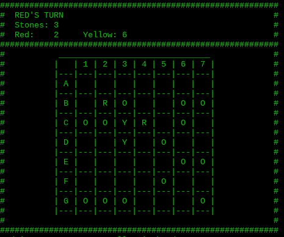
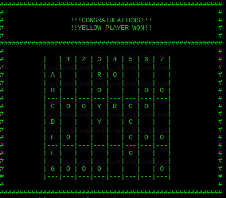

> R - Carpa Vermelha;  
> Y - Carpa Amarela;  
> O - Pedra;

---

#### Visualização Do Estado do Jogo

Apos invocar o predicado play/0 para iniciar o jogo, é feito display de um menu que permite ao utilizador escolher entre os modos disponíveis.
 
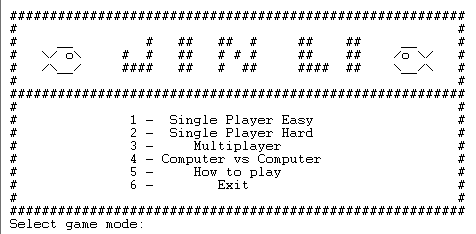

É feita a verificação do input do utilizador, que caso coincida com alguma opção leva o utilizador para a mesma, e caso contrario pede de novo o input dizendo que o anterior foi invalido.

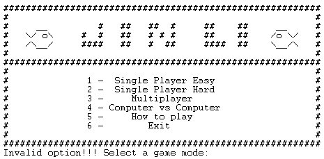

Codigo responsavel pelo display do Estado de Jogo:

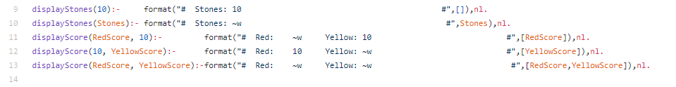
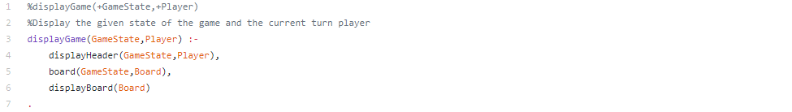
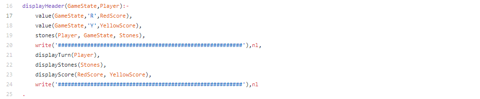
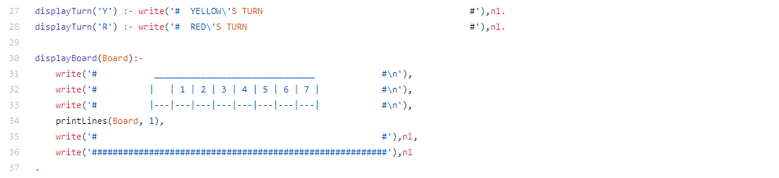
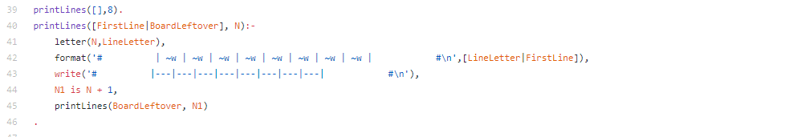

#### Lista de Jogadas Válidas
Existem, como referido em cima dois tipos de movimentos, nadar e saltar. Assim sendo temos de calcular todos os movimentos possíveis, sendo que, no caso de o movimento ser nadar a carpa apenas se pode mover para casas adjacentes e que estejam vazias. Os saltos são possíveis apenas quando existe uma pedra adjacente
á peça que se pretende mover e a casa imediatamente a seguir a pedra, na mesma direção, se encontra vazia.
Assim, como existem duas carpas é necessario calcular todos os movimentos possiveis para cada uma delas. O cálculo de todos os movimentos possiveis para uma carpa é feito pelo predicado findAllPossibleMoves.
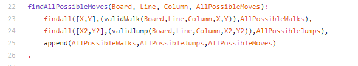

O cálculo dos movimentos válidos que o jogador pode fazer (conjunto dos movimentos possiveis das duas carpas) é depois calculado pelo predicado valid_moves.

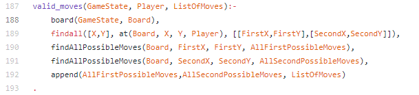

#### Execução de Jogadas
Para efetuar jogadas foi implementado o predicado move(+Gamestate, +Move, -NewGameState), que recebe um Gamestate e um movimento e após verificar que se trata de um movimento válido retorna NewGameState com a jogada já efetuada.
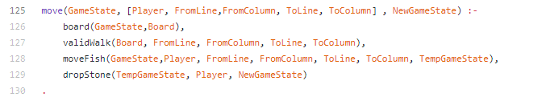
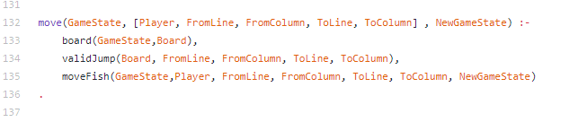


O predicado validWalk verifica, no caso de a jogada ser nadar, se o movimento e valido e o predicado moveFish efetua o movimento da carpa, seguido do predicado dropStone que efetua o movimento de pôr a pedra.
No caso de o movimento ser um salto e verificada a validade deste através do predicado validJump e feito o movimento.

#### Final do Jogo
O jogo chega ao fim quando um dos jogadores atingir pontuação igual a 10 pontos. Assim e necessário verificar depois de cada jogada se a pontuação do jogador que a fez chegou a 10.
Com esse fim foi implementado o predicado game_over(+GameState, -Winner) que recebe o GameState apos a jogada e retorna em Winner o jogador que fez a jogada caso a sua pontuação seja maior ou igual a 10.  

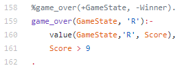
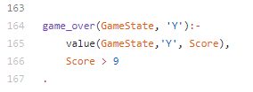  

#### Avaliação do Tabuleiro 
De forma a avaliar o estado de jogo foi implementado o predicado value(+GameState, +Player, -Value), que recebendo um Gamestate e o respetivo jogador (Player), retorna em Value a pontuação do jogador. 
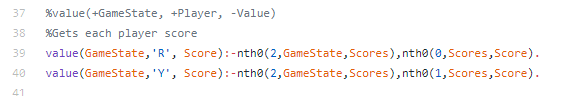

#### Jogada do Computador
A escolha da jogada a ser efetuada pelo computador varia com a sua dificuldade, podenendo ser *easy* ou *hard*.

Para o bot *easy* são calculados todos os movimentos possiveis e é escolhido um deles de forma random. O que pode ser feito através da função randomMove(+Board, +Player, +FromLine, +FromColumn, -ToLine, -ToColumn), como cada jogador possui dois peixes é primeiro sorteado um peixe a se mover e entrão o predicado unifica *ToLine* e *ToColumn* como a posição a qual o peixe vai. 

```
randomMove(Board, Player, FromLine, FromColumn, ToLine, ToColumn):-
    findall([X,Y], at(Board, X, Y, Player), PlayerFishes),
    random_member(PlayerFish, PlayerFishes),
    [FromLine,FromColumn] = PlayerFish,
    findAllPossibleMoves(Board, FromLine, FromColumn, AllPossibleMoves),
    random_member(Move, AllPossibleMoves),
    [ToLine, ToColumn] = Move
.
```

Já para o bot *hard* é escolhida a melhor jogada gananciosa, isto é que vai possibilitar a melhor pontuação ou menor distância aos outros peixes, no momento imediato. Para isso é feito o cálculo da distancia entre cada peixe do computador e todos os demais peixes, desta forma a jogada escolhida para cada peixe é aquela que o deixará mais próximo de todos os outros peixes. Após este cálculo é escolhido qual dos dois peixes irá se mover, isso faz-se através da avaliação das distancia do até os outros peixes juntamente como a possibilidade de pontuação, de tal forma que irá se mover o peixe que está mais distantante dos outros peixes, fazendo sua jogada que o deixará mais próximo, ou o peixe que fazendo sua jogada pontuará mais. Existindo uma relação arbitrária entre a vantagem de pontuar e as unidades de distância, de 1 para 5.

bestMove(+Board, +X, +Y, -BestMove, -Distance)
Calculo da melhor jogada para cada peixe, onde  *BestMove* é a jogada a ser feita e *Distance* é a composição de distância e pontuação para avaliar qual  dos dois peixes irá se mover. 
```
bestMove(Board, X, Y, BestMove, Distance):-
    findAllOtherFishes(Board, X, Y, OtherFishes),
    findAllPossibleMoves(Board, X, Y, AllPossibleMoves),
    findAllMovesScores(Board, X, Y, AllPossibleMoves, Scores),
    findAllDistances(AllPossibleMoves, OtherFishes, Distances),
    listSub(Distances, Scores, DistancesLessScores),
    min_member(SmallestDistance,DistancesLessScores),
    nth0(Index, DistancesLessScores, SmallestDistance),
    nth0(Index, Scores, Score),
    distanceSum(X,Y, OtherFishes, DistanceSum),
    Distance is DistanceSum + (Score*5),%5 = Score weight for choosing move
    nth0(Index, AllPossibleMoves, BestMove),!
```

bestMove(+Board, +Player, -FromX, -FromY, -ToX, -ToY)
Escolha de qual peixe entre os dois do computador irá se movimentar.
```
bestMove(Board, Player, FromX, FromY, ToX, ToY):-
    findall([X,Y], at(Board, X, Y, Player), [[FromX,FromY],[SecondX,SecondY]]),
    
    bestMove(Board, FromX, FromY, [ToX, ToY], FirstDistance),
    bestMove(Board, SecondX, SecondY, [_,_], SecondDistance),
    FirstDistance > SecondDistance
.

bestMove(Board, Player, FromX, FromY, ToX, ToY):-
    findall([X,Y], at(Board, X, Y, Player), [[_,_],[FromX,FromY]]),
    bestMove(Board, FromX, FromY, [ToX, ToY], _ )
.
```

Após as jogadas do tipo *Walk* se houverem pedras restantes para ser jogadas, uma pedra é colocada no tabuleiro em um local vazio. Dado em vista que: a colocação da pedra acontece após o movimento do jogador, e o resultado desse colocação, se beneficia ou prejudica o adversário, só pode ser percebido depois da jogada do jogador humano e exigiria uma verificação de mais de uma jogada no futuro. Então para esta escolha ser feita de maneira optima não seria possível através de um algoritmo ganancioso como o experado dentro do escopo do projeto. Por isso em ambos os modos *hard* e *easy*  a posição onde a pedra é colocada é escolhida de forma aleatoria.

Movimentação do computador quando se precisa por uma pedra ao tabuleiro:
```
nextTurn(GameState, Player, GameMode) :-
    board(GameState, Board),
    nextPlayer(Player, Computer),
    
    moveByMode(GameState, Computer, FromLine, FromColumn, ToLine, ToColumn, GameMode),
    
    validWalk(Board, FromLine, FromColumn, ToLine, ToColumn),
    stones(Computer,GameState, Stones),
    Stones > 0,

    moveFish(GameState,Computer, FromLine, FromColumn, ToLine, ToColumn, TempGameState),
    board(TempGameState, TempBoard),
    findall([X,Y], at(TempBoard, X, Y, ' '), FreePlaces),
    random_member([StoneLine,StoneColumn], FreePlaces),

    replaceInMatrix(TempBoard, StoneLine, StoneColumn, 'O' , NewBoard),
    removeStone(GameState,Computer,NewGameState),
    
    cls,
    displayGame(GameState, Computer),

    nextTurnBot(NewGameState, Player, Computer, NewBoard, ToLine, ToColumn, GameMode)
.
```

Movimentação quando não se coloca a pedra
```
nextTurn(GameState, Player, GameMode) :-

    nextPlayer(Player, Computer),
    
    moveByMode(GameState, Computer, FromLine, FromColumn, ToLine, ToColumn, GameMode),
    moveFish(GameState,Computer, FromLine, FromColumn, ToLine, ToColumn, NewGameState),
    board(NewGameState, NewBoard),
    
    cls,
    displayGame(GameState, Computer),

    nextTurnBot(GameState, Player, Computer, NewBoard, ToLine, ToColumn, GameMode)
.
```

### Conclusão 
Em conclusão, achamos que o objetivo do projeto foi alcançado e foram implementadas todas as features pensadas para o jogo. Com este trabalho foi permitido aprofundar e aplicar os conhecimentos adquiridos nas aulas, bem como mudar o paradigma de programação a que estamos habituados com a utilização de linguagens imperativas.
Foi essa, assim, uma das maiores dificuldades do trabalho uma vez que foi necessário desenvolver o pensamento recursivo mas concluímos que com este desafio ganhamos mais capacidade para implementar o mesmo. Uma das coisas que achamos que poderia ser melhorada seria a implementação de uma melhor Inteligência Artificial para a decisão das jogadas do computador 
mas pensamos que esse não era um dos objetivos principais do trabalho. Em suma, consideramos que o trabalho foi produtivo e permitiu aprofundar o conhecimento da linguagem Prolog.

### Bibliografia
https://nestorgames.com/#jinli_detail